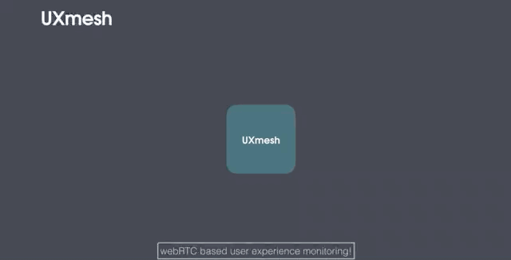

# UXmesh
* User experience monitoring
* Real end-to-end data
* Dynamic and scaleable


**User**

„WTF! Is it just me having problems or are the network engineers doing a shitty job? They will just tell me that the problem is on my side, anyway. What if I could actually run the same tool on my client as the network engineer does on his devices so he can see the same I do?“

Are your users sometimes complaining about network performance and you can’t give them a verified response because you’re missing a holistic end-to-end network performance monitoring?
Is the problem on the user end? Is the problem on a mediatory device? How can we make sure that all involved talk the same language and that experienced problems can be addressed in the right manner?

**Network Engineer**

„Well, of course it’s a shame we can’t easily see how our network’s performance looks like on the user client itself, that we miss the last mile. A simple, real-world end user experience monitoring to extend our low level monitoring data? And all in an easy solution? Yeah, that would be awesome!“

Good news! We understand you and built exactly that!
**UXmesh**, an end-to-end user experience monitoring tool, that brings real-life monitoring to a whole new level.
Get data from the clients browser, network components and even further!
So, don't rely on your clients subjective opinion. Give him a tool to deliver live, unbiased data you can work with.

So, with **UXmesh** you can easily test end-to-end performance throughout your network up into any user’s browser. And thanks to the new Docker support on the **Cisco Catalyst 9000 Switches**, even your network appliances are integrated in a breeze! Your network end-to-end performance monitoring is now a piece of cake!
On user clients, servers and network appliances with the exact same code! How cool is that?

Try it out and use the UXmesh Docker TM image to turn your **Cisco Catalyst 9000 Switches** into performance monitoring nodes across your whole network!

**Cisco Catalyst 9000 Switches with Docker support! Thanks Cisco!**

### What it can do

When some client runs the UXmesh code, it calls home to the UXmesh server and joins the waiting room. As soon as a second client joins, a webRTC channel is established directly between the two clients. The quality of this channel is now evaluated by the code running on either client and the data is sent back to the UXmesh server.

As soon as a third client joins, this client establishes channels to either already active clients, and so forth.



The new capability of the **Cisco Catalyst 9000 Switches** to host and run docker images now allows to not only monitor between client browsers and servers, but to monitor each network segment by itself! Browser to switch, switch to switch, switch to server!
And if necessary, that can be done in full mesh!


```
Docker image has been installed and "running" on the Catalyst 9000 instance in the "IOS XE on Catalyst 9000 16.12 EFT Code" Sandbox.
Caused by the sandbox restrictions that disallow internet and interdevice connectivity and the need of the project to be deployed on at least three switches to make sense, the next phase would be to validate the project on physical instances of Cisco switches. 
```
### Get proactive!

Yay, Proactive Monitoring! Use the application recognition capabilities of Cisco NBAR2 to identify webRTC traffic and its way through the network to proactively monitor this route! Where and when needed! Scaleable, dynamic and end-to-end!

### How it works


## features
### The client
+ etablishes a connection to the server, to retreive a list of all clients in the network
+ connects to each client in the network directly with webRTC
+ can be executed as a docker container on a device or as client-side-code in the browser
### The server
+ aggregate data received from clients
+ holds a list of all clients, which are connected to each other
+ returns the list of all clients to each conneting client
+ provides a http endpoint and delivers the graphical UI to see fancy animations of the collected network data

## Server setup
### Run the server on the command line
prerequisites:
--> install node in version 10.x or higher
```
brew install node
npm install
```
with debug output:
```
DEBUG=* npm run server
```
regular:
```
npm run server
```
### Deployment with docker

the docker image contains `apt-get` calls to install `tcpdump` and `net-tools` to provide some network analysis inside the running docker container.
further the image is built with the `node:10` base image, which provides some native debian commands inside the container during runtime.

#### Create the docker image for the server
```
docker build -f Dockerfile.server  -t uxmesh:server .
```
proceed docker deployment as your enviroment demands

##### Open graphical UI

type in browser: `your-domain-of-your-uxmesh-server/`


## Client Setup
### Run the client on the command line

Prerequisites:
--> install node in version 10.x or higher
```
brew install node
npm install
```
With debug output:
```
DEBUG=* npm run client
```
Regular:
```
npm run client
```
Use optional parameter to set uxmesh-server address (default is http://localhost:3001):
```
npm run client http://uxmeshserver.your-domain.com
```

#### Run the client in the browser

type in your browser: `your-domain-of-your-uxmesh-server/clientworker.html`
default is `http://localhost:3001` 

### Deployment with docker

the docker image contains `apt-get` calls to install `tcpdump` and `net-tools` to provide some network analysis inside the running docker container.
further the image is built with the `node:10` base image, which provides some native debian commands inside the container during runtime.

#### Create the docker image for the client
```
docker build -f Dockerfile.client  -t uxmesh:client .
```
proceed docker deployment as your enviroment demands

#### Additional resources

  * chrome://webrtc-internals/
  * https://github.com/feross/simple-peer (see perf dir for simple perfomance test example)
  * https://d3js.org/
  * https://gist.github.com/d9bf021c395835427aa0.git
  * https://blogs.cisco.com/developer/code-for-catalyst-challenge-is-now-open
